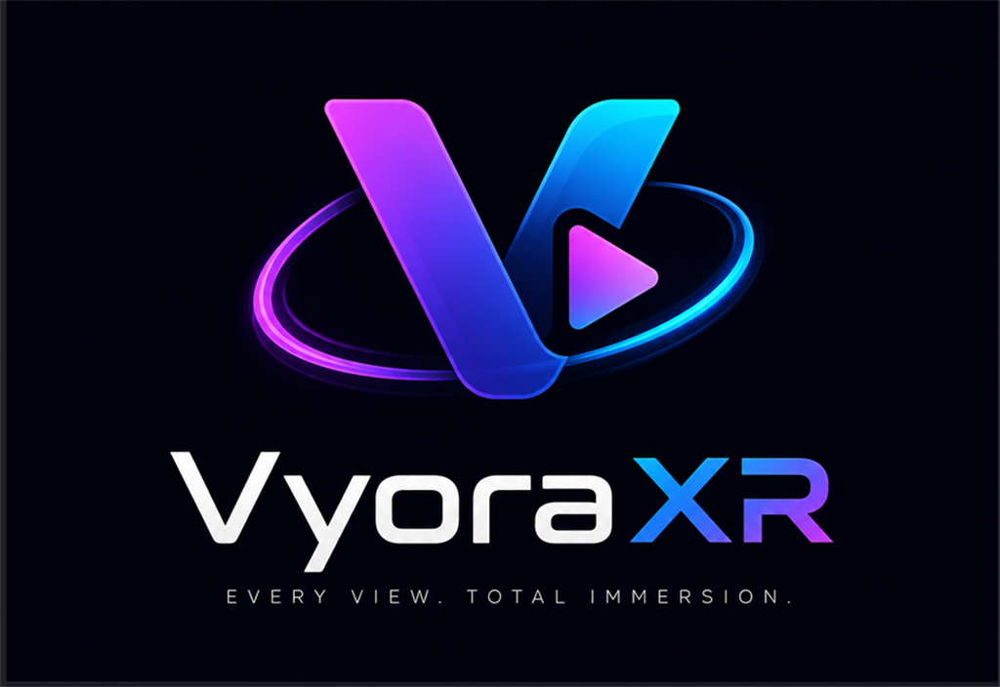

  

  <strong>A Quest-native media hub for personal libraries, compatible websites and immersive playback.</strong>

  
  
  

# VyoraXR

VyoraXR is a media browser and player designed for Meta Quest. It brings compatible media sources, local files and network libraries together in a windowed, controller-friendly interface, with dedicated immersive playback modes when you want them.

## Highlights

- Browse Stash libraries directly, including scenes, performers, studios, tags and galleries
- Connect supported PLAYA VR websites
- Browse Eporner and RedTube from native in-app library views
- Open local files and SMB network libraries
- Explore supported online video and live sources
- Play 2D, 180-degree, 360-degree and stereoscopic media
- Switch from the windowed interface to immersive playback with environment options
- Navigate with Quest controllers, including consistent Back and gallery controls

## Supported Sources

- **Stash direct:** scenes, performers, studios, tags, galleries and authenticated libraries
- **PLAYA VR websites:** connect compatible websites by URL, including supported authentication
- **Eporner:** search, sorting, VR discovery, pagination and in-app playback
- **RedTube:** search, categories, sorting, pagination and in-app playback
- **Chaturbate:** live-room browsing with affiliate filtering, search and gender categories
- **Stripchat:** live-room browsing with Featured, Women, Men, Couples and Trans categories
- **Local and LAN:** local Quest files and SMB network shares

## Downloads

Download the [latest alpha](../../releases/tag/v0.1.0-alpha9), or view all builds and patch notes on the [Releases](../../releases) page.

VyoraXR is currently alpha software. Features, compatibility and stored settings may change between releases.

## Installation

1. Download the latest alpha APK from Releases.
2. Install it on a compatible Meta Quest device using ADB or another trusted sideloading tool.
3. Add your own compatible sources from within the app.

## Requirements

- Meta Quest 2, Quest Pro, Quest 3 family or a compatible future Quest device
- Developer mode for sideloading
- Network access for online or LAN-based sources

## Source code

This repository is used for public releases and documentation only. VyoraXR is proprietary software; its application source code is not published here.

## Support

Use the GitHub Issues section to report bugs. Do not include passwords, API keys, server credentials or private media URLs in an issue.

## Legal

Users are responsible for the sources they configure and for complying with applicable laws and the terms of those services. VyoraXR does not host media.
