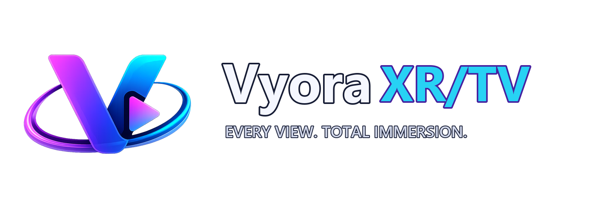
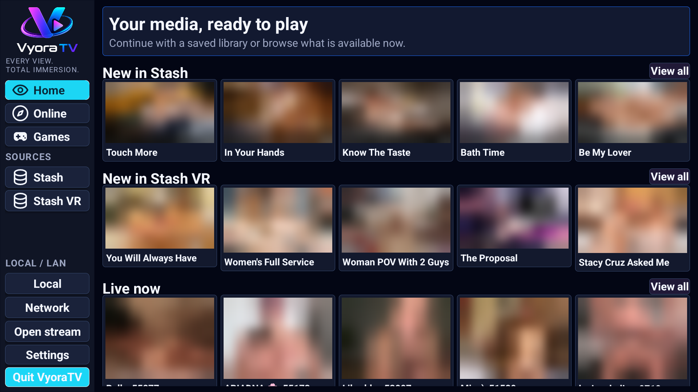
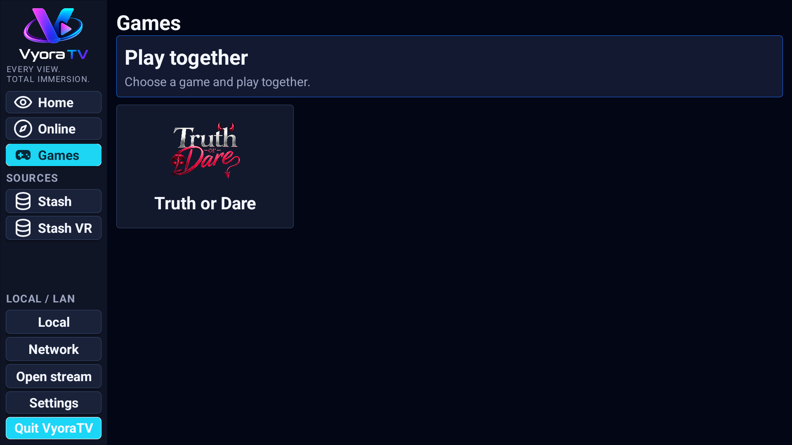
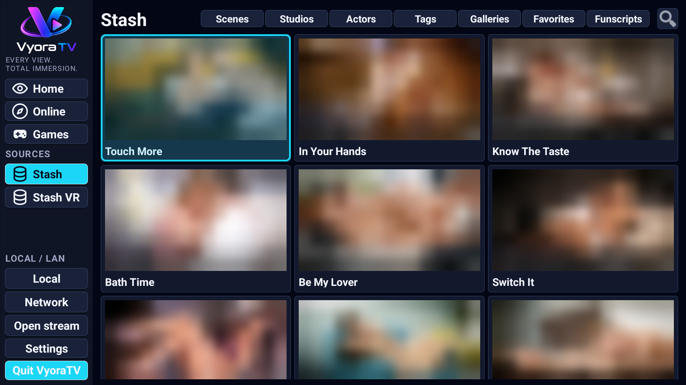

<p align="center">
  
</p>

<p align="center">
  <strong>A controller-friendly media library for Meta Quest and Android TV, with immersive VR playback on Quest.</strong>
</p>

<p align="center">
  <a href="https://github.com/SJoWie80/Vyora/releases/latest"></a>
  
  
</p>

# VyoraXR / VyoraTV

VyoraXR is the Meta Quest edition with a windowed library and immersive player. VyoraTV is the Android TV edition: a focused 2D media library controlled with a TV remote or gamepad.

Both editions browse personal libraries, compatible websites and local/network media from one controller-friendly interface.

## Why Vyora?

Vyora brings personal Stash libraries, local and network media, compatible online sources and interactive hardware into one focused interface. It provides direct access to scenes, performers, studios, tags, galleries, favorites and funscripts without requiring a separate bridge service.

Use VyoraTV from the couch with a D-pad-focused Android TV interface, or browse in a window on Meta Quest and enter immersive playback only when desired. VyoraXR supports flat, 180-degree, 360-degree, SBS, top-bottom and passthrough-oriented media, with automatic format detection where source metadata or filenames provide enough information.

Interactive playback is supported through [Intiface Central](https://intiface.com/) on VyoraXR and VyoraTV. VyoraXR also provides native Bluetooth control for compatible [OSSM](https://ossm.tech/) machines. Tagged Stash scenes can load their funscripts, follow video playback and expose adjustable intensity controls for connected hardware.

Saved sources, favorites, credentials and device settings remain local to the app. Online sources and live cams are optional and can be disabled from Settings.

## Android TV

VyoraTV is the focused 2D edition for Android TV devices and emulators. Its modern two-panel library provides dedicated Home, Online and Games views with visible D-pad focus, grid navigation, Back handling and TV playback controls.

<p>
  <a href="assets/android-tv/vyoratv-home.png"></a>
  <a href="assets/android-tv/vyoratv-games.png"></a>
  <a href="assets/android-tv/vyoratv-scenes-blurred.png"></a>
</p>

## Core Features

- Direct Stash browsing: scenes, studios, performers, tags, galleries and images
- Stash scene details, local favorites and funscript discovery
- Local files, direct streams, SMB and LAN media
- Pagination, source-specific search and cached thumbnails
- VyoraTV Games hub with an offline, multilingual Truth or Dare party game
- Windowed playback and immersive VR playback with Void and room environments
- Controller navigation, gallery photo browsing and consistent Back controls

### Optional Online Sources

- PLAYA VR API-compatible websites with supported authentication
- Chaturbate live cams with search, gender filters and viewer sorting
- Stripchat live cams with Featured, Women, Men, Couples and Trans categories
- Eporner, RedTube and ImageFap sources

Online sources can be enabled or disabled individually from **Settings > Manage Sources**.

### Interactive Hardware

- Intiface Central integration for supported toys and Stash funscripts
- Native Bluetooth control and funscript playback for compatible [OSSM](https://ossm.tech/) machines in VyoraXR

## Supported Sources

### Stash Direct

Connect directly to your Stash server using its URL, username and password or API key. Stash Direct supports scenes, studios, performers, tags, galleries, images, favorites and funscripts. See the [official Stash documentation](https://docs.stashapp.cc/) and [Stash GitHub project](https://github.com/stashapp/stash).

### PLAYA VR Websites

Add a website URL and Vyora checks whether it exposes the PLAYA VR API. PLAYA VR API-compatible websites expose their supported library, media and authentication flow inside the app.

### Online Sources

- **Chaturbate:** live rooms with search, gender filters and viewer sorting
- **Stripchat:** featured and category-based live rooms
- **Eporner:** video browsing, search, sorting, pagination and galleries where available
- **RedTube:** video browsing, categories, search, sorting and pagination
- **ImageFap:** public gallery categories, gallery browsing, image counts and photo viewing

## Installation

1. Download the latest beta APK from [GitHub Releases](https://github.com/SJoWie80/Vyora/releases/latest).
2. Install the Quest APK on a Meta Quest, or install the TV APK on an Android TV device/emulator.
3. Launch the app and configure a source in **Settings > Manage Sources**. For Quest developer setup, see the [Meta Quest developer documentation](https://developers.meta.com/horizon/documentation/native/android/mobile-device-setup/).

### Install VyoraTV with Send Files to TV

1. Install **Send Files to TV** on the Android TV device and on the phone or computer used to transfer files.
2. Download `VyoraTV-<version>-AndroidTV.apk` from the latest GitHub release.
3. Send the APK to the Android TV device and open it there with a file manager or package installer.
4. If Android asks, allow **Install unknown apps** for the receiving or file-manager app.
5. Install the APK and launch VyoraTV from the Android TV Apps menu.

Updates can also be checked from **Settings > Check for Update** inside VyoraTV.

Example ADB command:

```bash
adb install -r VyoraXR-release.apk
```

## Stash Setup

Open **Settings > Manage Sources**, add a Stash source and enter:

- The complete Stash server URL, including a non-default port
- A custom bookmark name
- Username and password, or the API key supported by your server

Credentials and bookmarks are stored locally on the Quest. Favorites are also local, so different users can use the same Stash server with separate favorite lists.

## Stash Tagging and VR Detection

VyoraXR detects the playback mode automatically from recognizable filenames and metadata. Tags and filename tokens are recommended because they make the intended mode explicit and can resolve ambiguous files; they are not required for every video. Use clear tokens separated by spaces, underscores, hyphens or brackets.

| Purpose | Accepted examples |
| --- | --- |
| 180-degree video | `180vr`, `vr180`, `180 video`, `sbs180`, `lr180` |
| 360-degree video | `360vr`, `vr360`, `360 video`, `equirectangular`, `sbs360` |
| Side-by-side stereo | `sbs`, `hsbs`, `fsbs`, `lr`, `left-right` |
| Top-bottom stereo | `tb`, `ou`, `over-under`, `ud` |
| Monoscopic video | `mono`, `monoscopic`, `mono180`, `2d180` |
| AR/passthrough | `ar`, `ar1`, `ar2`, `passthrough`, `alpha`, `chroma`, `green screen` |

Examples:

```text
SceneName_180vr_SBS.mp4
SceneName_VR180_LR.mp4
SceneName_360_equirectangular_TB.mp4
SceneName_180vr_mono.mp4
SceneName_180vr_AR2.mp4
```

An 180-degree video is treated as stereoscopic/LR by default when no `mono` token is present. Add `mono` explicitly for a genuine monoscopic 180-degree video.

## Funscripts

Add the exact Stash tag:

```text
funscript
```

The scene must have this tag and expose a reachable Stash funscript endpoint. Tagged scenes appear under **Funscripts** and can show an interactive heatmap in the scene details.

When a tagged scene starts playing:

- Connected Intiface devices switch to funscript intensity mode.
- A connected OSSM switches to funscript controls for speed, stroke and depth.
- OSSM funscript speed, stroke and depth initially default to 25% and remember later adjustments.
- Funscript output is sent to all connected supported devices.
- Stopping or leaving the scene stops the actuators.

## Intiface Central

VyoraXR uses Intiface Central as the Bluetooth/device layer. Bluetooth pairing is performed by Intiface Central, normally on an Android phone; VyoraXR connects to its WebSocket server over Wi-Fi.

### Quick Start

1. Install and open Intiface Central on the phone.
2. Start the Intiface engine and enable its WebSocket server.
3. Find the computer or phone's Wi-Fi address. It may use a private LAN range such as `192.168.x.x`; use the actual address shown by your network.
4. In VyoraXR open **Settings > Toy Control**.
5. Enter the WebSocket address, for example:

```text
ws://<server-ip>:12345
```

6. Connect or scan for the toy in Intiface Central.
7. Enable **Auto-connect Intiface Central** if VyoraXR should connect at startup.

The default for Auto-connect is disabled on a new installation. VyoraXR remembers the last server address.

The control popup appears only after a successful connection. VyoraXR checks the connection continuously, refreshes connected devices, closes the popup on disconnect and retries automatically when Auto-connect is enabled. See the [Intiface Central documentation](https://intiface.com/docs/intiface-central/quickstart/) or [Intiface Central website](https://intiface.com/).

## Native OSSM Support

VyoraXR can connect directly over Bluetooth to compatible [OSSM](https://ossm.tech/) machines. This native route is separate from Intiface Central and is available in the Meta Quest edition.

### Quick Start

Open **Settings > OSSM**, start a scan and select the detected machine. After connecting, VyoraXR opens a movable OSSM control window with:

- Play and Stop
- Speed, stroke and depth
- Pattern and sensation
- `-` and `+` controls for precise controller input

Manual settings are stored locally, but every new connection starts stopped and performs safe positioning before motion begins. For a tagged Stash funscript, the control window changes to speed, stroke and depth limits. The same controls are available from the immersive VR player panel. VyoraXR drops obsolete Bluetooth motion commands and follows the current video position to reduce funscript latency.

## Player and VR Mode

The library remains windowed by default. Select VR mode from the player controls for immersive playback.

- **Void** is the default black environment.
- Additional HDRI room environments may be available when configured in the build.
- 2D video is centered in the current field of view when VR mode starts.
- The image can be grabbed and moved with the grip button.
- VR exit controls can be recalled with the trigger.
- The B button exits VR mode or navigates back where applicable.
- Video mode depends on the filename/metadata tokens described above.

## Settings

- **Manage Sources:** add, edit and remove source bookmarks
- **Toy Control:** Intiface Central server address, connection and separate control popup
- **Auto-connect Intiface Central:** connect automatically at startup; disabled by default
- **OSSM:** direct Bluetooth scanning, connection and native OSSM controls in VyoraXR
- **Language:** English, Nederlands, Deutsch and Français
- **Live Cams enabled:** show or hide live sources
- **RedTube enabled:** show or hide RedTube
- **Eporner enabled:** show or hide Eporner
- **ImageFap enabled:** show or hide ImageFap
- **Start with last source:** reopen the last selected source at startup
- **Clear image cache:** remove locally cached thumbnails and images

## Troubleshooting

### Stash returns HTTP 401

Check the server URL, username and password/API key. Edit and save the bookmark again after changing credentials on the server.

### Stash returns HTTP 422

Check server compatibility and authentication. For Funscripts, use the exact `funscript` tag and ensure the scene exposes its funscript endpoint.

### Thumbnails are black

Make sure the Quest can reach the active source. Switch to the correct bookmark and use **Settings > Clear Image Cache**, then reload the source.

### Intiface does not connect

Confirm that the phone and Quest are on the same network, the Intiface WebSocket server is running, and the phone's Wi-Fi IP is used. Home networks may use different private subnets; do not assume a fixed subnet.

### A VR video is displayed incorrectly

Correct the filename or metadata tags. Use `180vr`, `360vr`, `sbs`, `lr`, `tb` or `mono` as appropriate. A missing stereo token can make an SBS file appear as a flat image.

## Beta Status

VyoraXR and VyoraTV are beta releases. Core library browsing, local/network playback and the main controller workflows are usable, but behavior can still change between versions.

Current limitations:

- Third-party website APIs and page structures can change without notice.
- Automatic VR detection depends on recognizable metadata, tags or filenames when a source does not identify the format clearly.
- Intiface and native OSSM compatibility depends on the connected device, firmware and network or Bluetooth environment.
- GitHub builds are sideloaded and Android may require permission to install updates from the chosen installer app.

When testing interactive hardware, begin with conservative speed, stroke and depth settings and keep the machine's physical stop controls accessible.

## Privacy and Legal

VyoraXR is a client for sources configured by the user. It does not host media. Users are responsible for their sources, content rights, applicable laws and service terms. Do not include passwords, API keys, private media URLs or personal server details in issue reports.

## Public Repository Scope

This repository contains public release APKs, documentation, store assets and release notes only. VyoraXR application source code is proprietary and is not published here.

## Support

Use [GitHub Issues](https://github.com/SJoWie80/Vyora/issues) for reproducible bugs and feature requests. Include the app version, Quest model and a short description, but never include credentials or private URLs.

See the combined [release notes](RELEASE_NOTES.md) for the public release history.
